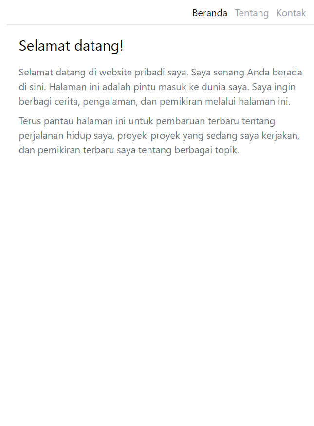

## Cara menjalankan

1. Install Node.js https://nodejs.org/en/download/
2. Jalankan `npm install` di terminal
3. Lalu `npm run dev` di terminal
4. Buka `http://localhost:5173/` di browser
5. Untuk melakukan testing jalankan `npm run test` di terminal

## Hasil Testing

## Stateless Component

Componen yang memiliki konten static. Stateless component hanya menerima props dan mengembalikan JSX.

## Stateful Component

Componen yang memiliki state. Stateful component memiliki state dan props. Stateful component dapat mengubah state dan mengembalikan JSX. Seperto contoh ketika form di submit maka halaman akan menampilkan hasil dari inputan.

